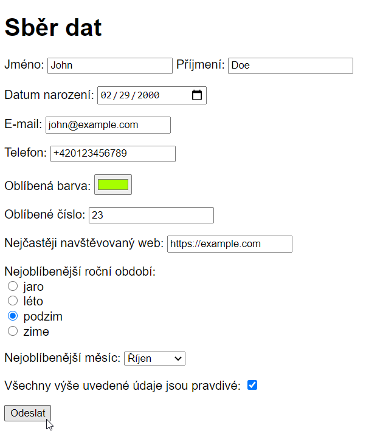

# Cvičení: Statistický úřad

## Zadání

1. Vytvoř stránku s formulářem, který bude odesílat data metodou `POST` na adresu `http://formular.itgirls.cz/`.

1. Účelem formuláře bude sesbírat od uživatele velké množství dat. Dbej na to, aby formulářové prvky byly správného typu a byly řádně označené štítkem.

   1. Přidej dva vstupy na jméno, zvlášť křestní jméno a zvlášť příjmení. Jako `name` použij `first-name` a `surname`.
   1. Vstup na datum narození s `name="birthdate"`.
   1. Vstup na e-mailovou adresu s `name="email"`.
   1. Vstup na telefonní číslo s `name="telephone"`.
   1. Vstup na nejoblíbenější barvu s `name="favorite-color"`.
   1. Vstup na nejoblíbenější číslo s `name="favorite-number"`.
   1. Vstup na nejčastěji navštěvovaný web s `name="website"`.
   1. Výběr nejoblíběnějšího ročního období pomocí `type="radio"` s `name="favorite-season"` a `value=` `spring`, `summer`, `autumn` a `winter`.
   1. Rozbalovací menu pro volbu nejoblíbenějšího měsíce `name="favorite-month"` a `value=` `january`, `february`, `march`, `april`, `may`, `june`, `july`, `august`, `september`, `october`, `november` a `december`.
   1. Zaškrtávácí políčko pro ptvrzení, že uživatel odpovídal pravdivě s `name="truthful"` a `value="yes"`.
   1. Na konec formuláře přidej tlačítko pro odeslání.

1. Vyzkoušej si formulář vyplnit a odeslat.

1. Backend z adresy formular.itgirls.cz ti vypíše, jaká data obdržel. Zkontroluj, že jsou všechna.

## Bonus

1. Libovolně formulář nastyluj.

1. Vedle odesílacího tlačítka přidej další, které obnoví formulář do původního stavu.

1. Před tlačítka vlož víceřádkové pole pro „Doplňující informace“ a `name="additional-information"`.

1. Zvýrazni červenou barvou chybně vyplněná políčka. Jak stylovat špatně vyplněné políčka najdeš například zde: https://css-tricks.com/almanac/selectors/i/invalid/. Vyzkoušej do políčka pro e-mailovou adresu vyplnit něco bez zavináče.

1. Udělej z kódu veřejnou webovou stránku přes GitHub Pages nebo [Netlify Drop](https://app.netlify.com/drop) a vyzkoušej si vyplnit formulář na telefonu.
